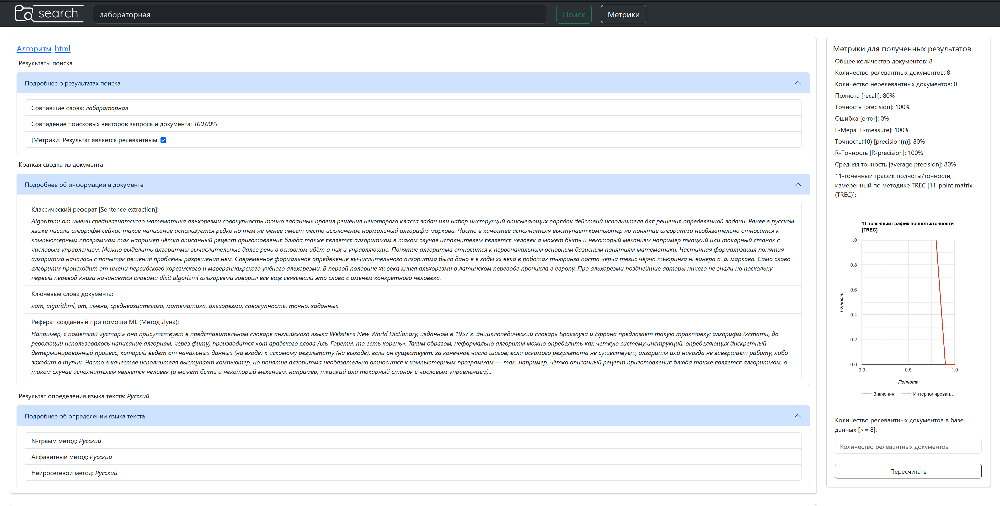

# Search-system 

*The system of information vector search in the local network for html documents. With metrics, language definition and summarization.*

### Description of the structure

The system consists of two parts, a microservice and a sub-client. 

Both are simple http servers in python. One sub-client is hosted on the main computer and sends requests to all microservers, which can be located not only on the local network, but also on the Internet. 

Each microserver stores a certain number of documents and responds to search queries. The search is vector-based, microservers accept only format requests that are created by the sub-client.

> [!TIP]
> The sub-client has endpoints that can be accessed from the client written on top. 

Subclient server is a kind of layer between a custom client and microservers, which has its own graphical interface with useful things such as metrics, language definition, summarization, voice input and other.


<div style="text-align: center;">Picture 1. example subclient interface with filled data (russian language).</div> 

### Start microserver

To work, it is enough to run one microserver. To do this, copy the folder containing the code to the directory you need and run the code with the command:

```
cd ./microserver
python3 main.py
``` 

At this stage, the microserver runs an http server to respond to requests and a web-crawler to index the contents of the `./microserver/documents` folder. The web-crawler builds search images for html files contained in this directory, and also fills the dictionary with found tokens, calculates search weights (TF-IDF). 

The dictionary is based on json format and contains different info about every file and all files in common.

> [!WARNING]
> The crawler automatically adds information to the dictionary and database, and removes it from there when adding and deleting files from the previously mentioned directory. If the server is unstable (constantly switching on and off during indexing), the crawler may get something wrong and require a complete cleaning of the database `documents.db` and the dictionary (deleting all character files and clearing information from `./server_dictionary/common_info.json`).

The crawler automatically indexes the files every specified period of time in the `variables.py` file. You can also set the time in the file after which the information about the file is considered outdated.

The global variables used in the program are described in files.

Database states have been entered for asynchronous operation of the crawler and the http-server. During the recording of data by the crawler, the database is unavailable for search queries. more about crewler in `crawler.py`

Description of http requests received by the microserver:

1. http://localhost:3000/documents – allows you to receive documents from a microserver;
2. http://localhost:3000/search?request_content=“request” – searches for the string specified in the request_content parameter (in the example, such a string is “request").

Since the system is designed for local networks, there is no proxy system for documents. It implies that the system users have direct access to microservers. When working with the system's website, the user can click on links to documents that use the address of the microserver on which this file is stored as the host address, and not the address of the subclient.

### Start subclient 

If you have a running microserver, then you can run a subclient with:

```
cd ./subclient
python3 main.py
```  

A custom http-server is used to search for documents in the system and gain access to the site. All available variables are in the file `variables.py`. 

> [!TIP]
> In this file u need to specify microservers as in example. 

The subclient supports two endpoints:

1. http://localhost:13000/site/ – allows you to access the subclient website; 
2. http://localhost:13000/search?request_content=“request” – searches for the string specified in the request_content parameter (in the example, such a string is “request").

The subclient compiles metrics based on microservers responses to user-created queries. However, metrics are compiled exclusively on the sub-clients website and there is no endpoint API for interacting with them. The whole logic of compiling metrics is in the `index.js` file. The sub-client sends requests to all microservers. And those, in turn, accept them and create answers to them.

In order to calculate metrics, it is not enough to know which of the received documents are relevant, you also need to know how many relevant documents are in the database. So this functionality is intended only for the system developer, and only for test samples of documents where the analysis is carried out and the values necessary for calculations are known.

## About language detection methods

Correct file changes are required to train the system. `microserver/variables.py` (when adding languages, use the same order for all variables associated with this process – `ALLOWED_DEICTIONARY`, `LANGUAGES_TO_DEFINE`, `LANGUAGES_ALPHABETS`). It is also possible to configure recognition methods using variables in this file. 

In addition to changing variables, training also requires a test sample of documents, which must be placed in the `documents_for_language_definer/documents_sources/*lang*/*source_doc_name*.html directory`. Each text should be in its own language directory, it is recommended to use the same number of texts of the same size for all languages.

#### N-gramm method 

For all languages of each document in the `documents_for_language_definer/documents_sources/*lang*/` directories, document profiles are built that store n-grams in descending order of frequency of their appearance for and are stored in the `documents_for_language_definer/documents_profiles/ ngrams/*lang*/` directory. The maximum length of the n-gram is specified in the microserver settings. After all the product profiles have been built, the system starts accepting requests for language detection. For each text received at the input to the determinant, an n-gram profile is built, and after that the distance between the constructed profile and all saved document profiles is found.

The distance between the statistics is calculated as follows: all n-grams are sorted in descending order of frequency of their occurrence, then for each n-gram the difference of its positions in the sorted list of n-grams of the test and the tested documents is calculated. The distance between the statistics is defined as the sum of the position differences of each n-gram. If the n-gram is missing from the category (language) profile, then it is assigned the maximum value of the N-gram position mismatch estimate.

#### Alphabetical method

The alphabetic method is based on determining the most frequently encountered characters in a document and comparing all alphabets available to the system. The language of the alphabet, which is closest to the alphabet of the text and is considered the language of the text.

#### Neural network method

To implement this method, third–party libraries for the python language were used - the `tensorflow` library and its `keras` wrapper. The `numpy` library was also used to process and prepare data for network training. The constructed neural network is an LSTM network. The quality of the neural network is determined by the accuracy criterion, `“accuracy”`, in the test sample this value reached up to 90% at three epochs of learning. 

Before training the neural network, data is processed and prepared. Each text for the required languages is tokenized and divided into sequences of the required length. After that, there is training. After training, the system accepts requests for language definitions using the neural network method. Each input text is also tokenized and divided into sequences of the required length.

## About summarizers 

In order for the abstract to be compiled inside the system, calls to each method were added to the web crawler. The system creates an abstract for each document in the system and stores the results of abstracting for each method in the document search image.

#### Sentence Extraction method

This method is an extractive text abstracting method and relates to machine learning.  In this approach, statistical heuristics are used to identify the most important sentences of the text. Formulas for determining the weights of proposals are described in the theoretical part of the report. Sentence extraction is an inexpensive approach compared to more science–intensive deeper approaches that require additional knowledge bases such as ontologies or linguistic knowledge. 

#### Keywords Extraction method 

Today, when large linguistic corpora are available, the meaning of `tf-idf`, which arose in the search for information, can be successfully used to identify the keywords of the text.

Enclosures were used in the form of the `spacy` library and its modules, when adding any language to the system, it is necessary to add the corresponding module for the space module. The system was tested on the modules `“ru_core_news_lg”`, `“it_cors_news_lg"`. Please note that the system will not work with languages that do not have the `“lang_cors_news_lg"` module.

#### Modified Luna method

[Original source](https://courses.ischool.berkeley.edu/i256/f06/papers/luhn58.pdf)

The modification, unlike the sentence extraction method, consists in splitting the sentence into chunks, and calculating their weights. Depending on the weights of these chunks, the weight of the entire offer also changes. In this case, the provisions of the sentence in the text are not taken into account, but its contents, the tokens that are included in it, are taken into account. 

# Conclusion 

If you want to develop the system or use it, please contact us by mail <eldarpoplauski111@gmail.com>


